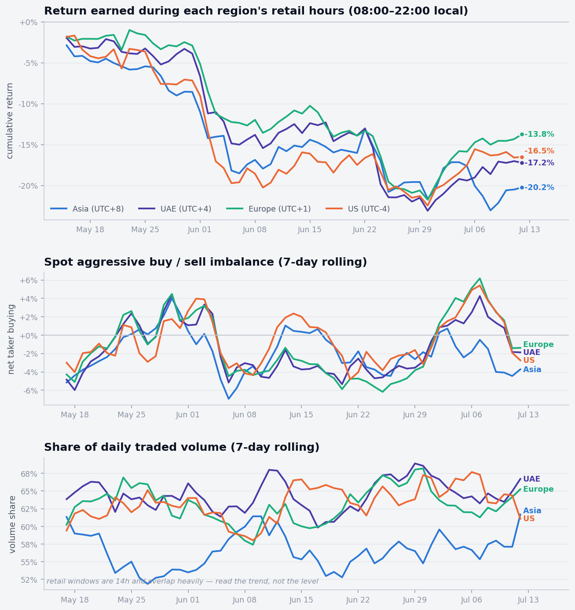
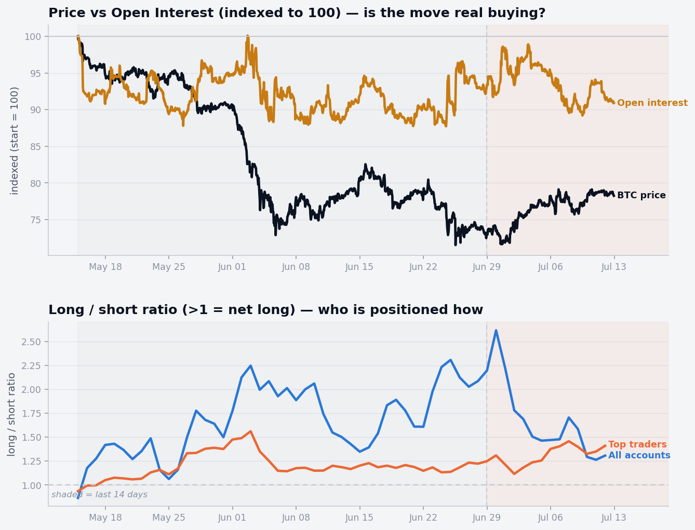
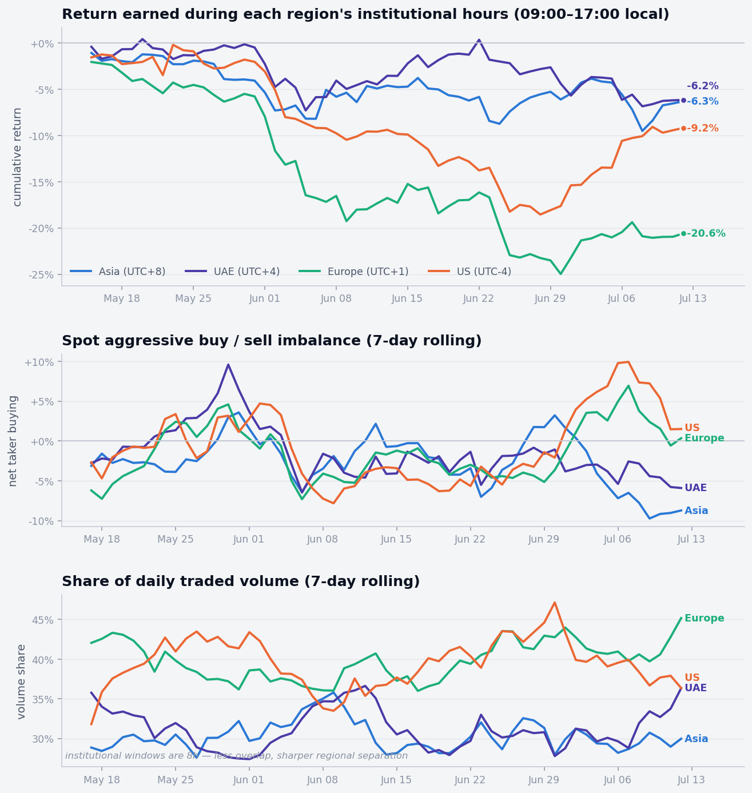
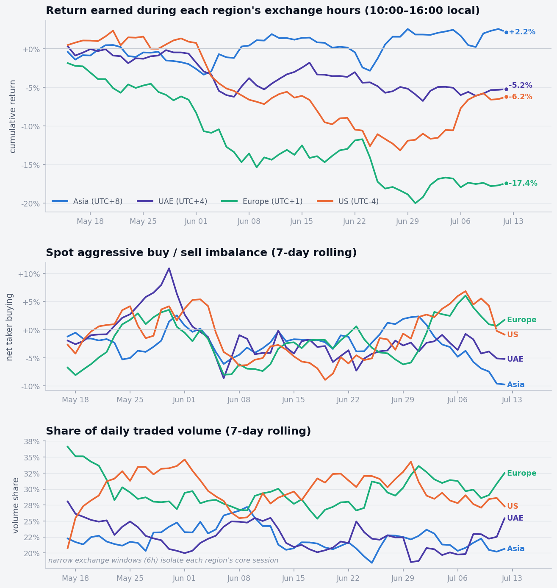

# BTC Session Flow Analysis

Splits Binance BTC price and USD-M futures data into **regional market sessions**
(Asia, UAE, Europe, US) and measures — per session — where return is earned, who is
aggressively buying, where volume concentrates, and whether moves are backed by real
leverage (open interest) or are just short-covering. One command produces a
self-contained HTML report and the markdown report shown below.

## How to use

```bash
pip install -r requirements.txt
python main.py
```

Open `output/index.html` for the full interactive report; `python main.py` also
refreshes the **Full report** section of this README and writes `output/report.md`.
Data is downloaded once from the free [Binance public data](https://data.binance.vision/)
service (no API key) and cached under `data/`.

```bash
python main.py --days 90               # longer window
python main.py --symbol ETHUSDT        # a different market
python main.py --regime institutional  # 09:00–17:00 local windows (also: retail, exchange)
python main.py --end 2026-06-30        # analyse up to a specific date
python main.py --refresh               # ignore cache, re-download
```

## Full report

<!-- REPORT:START -->

> **BTCUSDT** spot + USD-M futures · Binance · 15 May – 13 Jul 2026 UTC · generated 2026-07-14. Regenerate with `python main.py`.

### 1 · Session flow — retail hours (08:00–22:00 local)

<picture>
  <source media="(prefers-color-scheme: dark)" srcset="assets/dashboard_retail_dark.png">
  
</picture>

| Region | Full window | Last 14d | Recent flow |
|--------|------------:|---------:|------------:|
| Asia (UTC+8) | -20.2% | -0.8% | -3.1% |
| UAE (UTC+4) | -17.2% | +6.1% | -0.3% |
| Europe (UTC+1) | -13.8% | +9.0% | +1.1% |
| US (UTC-4) | -16.5% | +6.4% | +0.3% |

Over the window **Europe** held up best (-13.8%) and **Asia** worst (-20.2%). Recently **Europe** leads (+9.0%) and the most aggressive net buying sits in **Europe** hours (+1.1%).

### 2 · Open interest & positioning

<picture>
  <source media="(prefers-color-scheme: dark)" srcset="assets/open_interest_dark.png">
  
</picture>

**Short-covering.** Over the last 14 days price moved +7.1% while open interest moved -2.2% — the recent bounce came on **falling** open interest — positions closing, not fresh leveraged longs (classic short-covering). The all-account long/short ratio ran 0.86 → 1.31 (peak 2.62) while top traders went 0.94 → 1.41.

### 3 · Window-regime comparison

The regional signal is **highly sensitive to how you define a "session"** — the open-interest read is not. The same data on different clocks:

#### Institutional hours — 09:00–17:00 local

<picture>
  <source media="(prefers-color-scheme: dark)" srcset="assets/dashboard_institutional_dark.png">
  
</picture>

| Region | Full window | Last 14d | Recent flow |
|--------|------------:|---------:|------------:|
| Asia (UTC+8) | -6.3% | -0.8% | -7.2% |
| UAE (UTC+4) | -6.2% | -3.4% | -4.9% |
| Europe (UTC+1) | -20.6% | +3.5% | +1.5% |
| US (UTC-4) | -9.2% | +11.5% | +4.2% |

Over the window **UAE** held up best (-6.2%) and **Europe** worst (-20.6%). Recently **US** leads (+11.5%) and the most aggressive net buying sits in **US** hours (+4.2%).

#### Exchange hours — 10:00–16:00 local

<picture>
  <source media="(prefers-color-scheme: dark)" srcset="assets/dashboard_exchange_dark.png">
  
</picture>

| Region | Full window | Last 14d | Recent flow |
|--------|------------:|---------:|------------:|
| Asia (UTC+8) | +2.2% | +0.6% | -6.4% |
| UAE (UTC+4) | -5.2% | -0.3% | -3.8% |
| Europe (UTC+1) | -17.4% | +1.2% | +2.1% |
| US (UTC-4) | -6.2% | +8.0% | +1.9% |

Over the window **Asia** held up best (+2.2%) and **Europe** worst (-17.4%). Recently **US** leads (+8.0%) and the most aggressive net buying sits in **Europe** hours (+2.1%).

### 4 · Method & caveats

Each hourly candle is tagged by the region whose local window it falls in, using representative offsets (Asia (UTC+8), UAE (UTC+4), Europe (UTC+1), US (UTC-4)). "Return" sums log-returns of a region's hours; "flow" is `(taker-buy − taker-sell) / volume` (positive = market-buy orders lifting the offer). Open interest and long/short ratios come from Binance USD-M futures `metrics`; OI is BTC-denominated so it reflects positioning, not price.

_Session windows overlap (crypto trades 24/7), so volume shares sum past 100% and per-region attribution is coarse — read trends, not levels. Offsets are representative (no per-country DST). Futures metrics are Binance-only. A 60-day sample is a regime snapshot, not a rule. Not financial advice._

<!-- REPORT:END -->

---

_Released under the [MIT License](LICENSE). Not financial advice._
